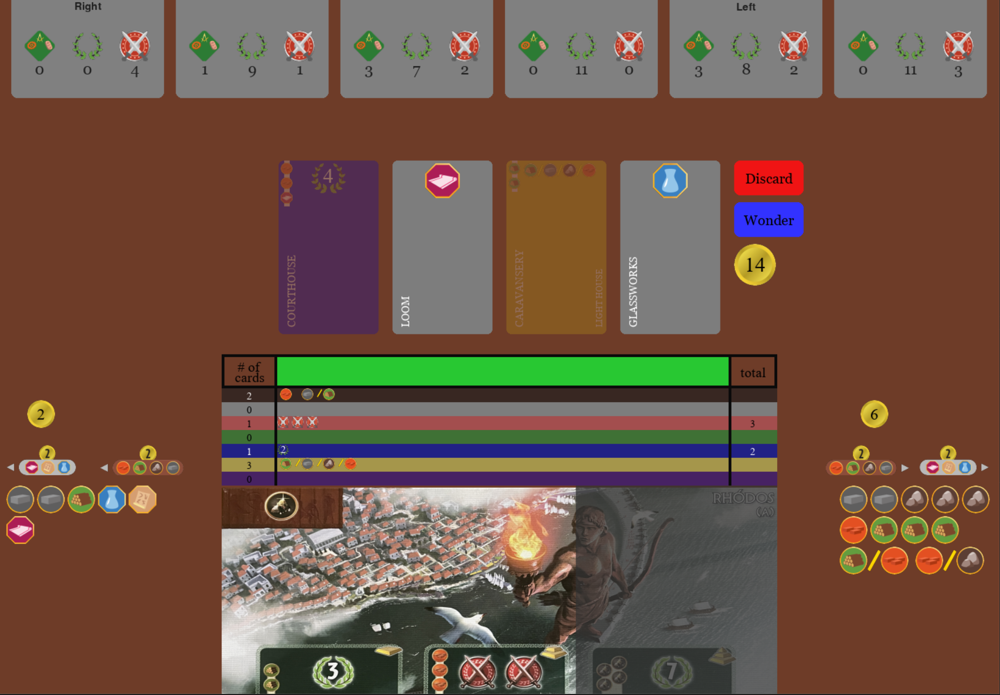
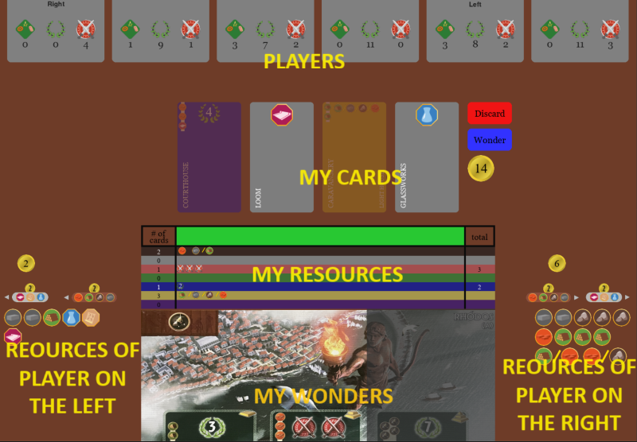
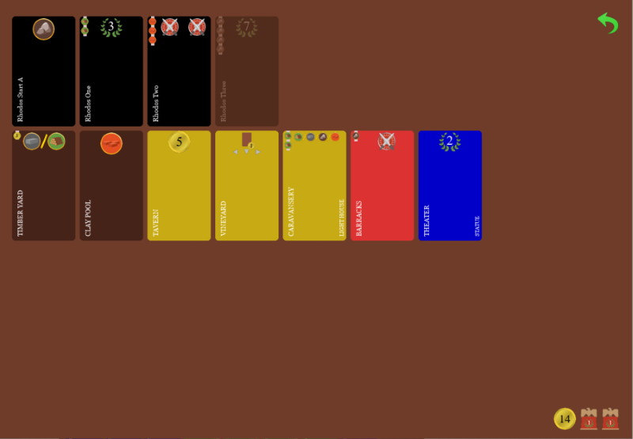

# 7 Wonders
    
This is a video game adaptation of the board game [7 Wonders](https://en.wikipedia.org/wiki/7_Wonders_(board_game)) written with Pygame. It is made for single player with the option to play against bots.



## About the Game

The computer game simulates all the features of standard base 7 Wonders game:

* Players are seated at the virtual table and your player can trade with players to the right and to the left.
* 3 decks of cards are shuffled for the 3 eras of the game and are dealt to the players.
* On each turn the cards are passed between players.
* Your player selects cards which go into your hand and the gathered resources are shown on the resource tracker.
* You can only buy cards if you have the required resources and money.
* When you trade with other players, the game calculates resource costs and moves money between players.
* You can purchase wonders if you have the required resources.
* Game score is added up and the winning player is announced (on the console) at the end of the game.


**About Implementation**
* Game uses pygame to do all the drawing.
* It uses a layered layout engine to calculate position and size of player areas, cards, resources, etc.
* It uses a Model View Controller (MVC) design pattern to separate game logic from layout, drawing, and events.
* Bots calculate value of each card, taking into acount future returns and price payed for purchased resources

## How to Install and Run

```
git clone https://github.com/DamianOliver/7wonders.git
cd 7wonders
pip install pygame
python 7wonders.py
```

## Instructions to Play


* Rectangles at top of screen show main resources of other players including points, shields, and science tokens. Click on these to see the cards purchased by that player.
* Resources on left on right of board are resources that are available for purchase from neighbors. Click on a resource to purchase it for the turn. Neighbor's gold as well as prices are also displayed above.
* Colored bands above wonder show resources that you have aquired from different card categories as well as the number of cards and total value of the cards where applicable.
* Your wonder shows the wonder that you have and what resources it provides as well as the costs of the next layers. Sections not yet purcased will be greyed out. 
* To play a card click on a card displayed in your hand. Cards that cannot be purchased with current resources will be greyed out. Purchase resources from neighbors to make them available. To discard press the discard button and then select the card to discard. To build a stage of your wonder click the wonder button and select the card you would like to build the wonder with. 
* To view your own cards click on the green rectangle above your wonder or on your own player display rectangle in the top right:


